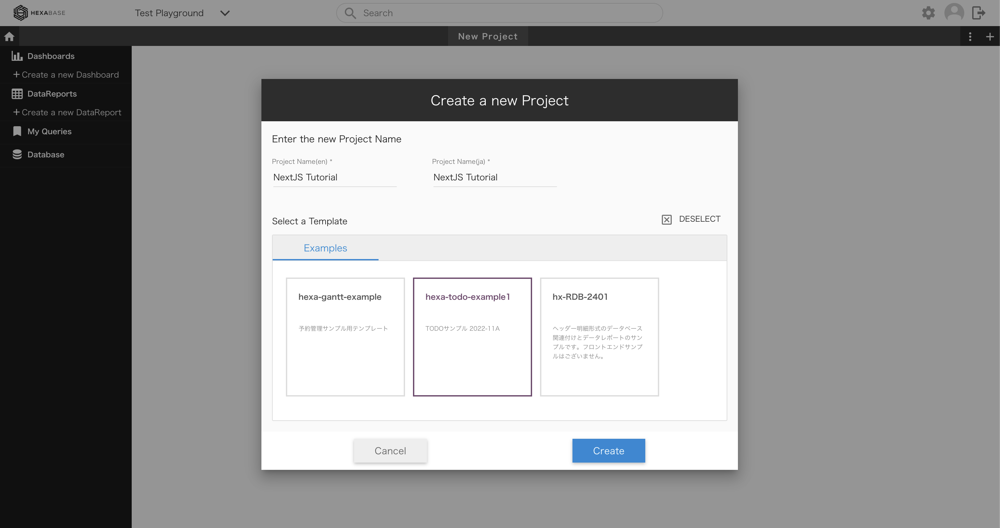

# Hexabase NextJS Tutorial / Demo App

This is a very basic sample NextJS app, which you can use as a tutorial to getting set up with Hexabase.
This will guide you from the very beginning, all the way to integrating with a Hexabase database, using actions and other backend extensions, and more.
After this tutorial, hopefully you will have a basic idea of how you can integrate Hexabase into your own NextJS application.

Table of Contents:

-   Hexabase Setup
-   CLI Setup
-   Using the Javascript SDK

## Hexabase Setup

This section will assume that you are a complete beginner: we will go over everything you need to get started.

### Creating a Project

First, navigate to the Hexabase dashboard at https://app.hexabase.com.

If you don't have an account, you will be redirected to login. Follow the steps to create an account, and then come back here.

> Warning: (Aug 2024) when creating a hexabase account, you should sign up by email, **not** by signing in directly via Google.
> It's possible you may have trouble using the CLI and Hexabase API otherwise.

Once you're in, you can do the following:

-   Choosing a workspace:
    -   a workspace is where projects can be created. workspaces can be used to separate different application ecosystems.
    -   for now, we will just use a test one called "Test Playground".
-   Creating a project:
    -   by default, in a workspace you will find a project simply called "New Project". You can use this, or you can create one and give it a name by clicking the plus button on the right side of the black toolbar.
    -   for this tutorial, I'm creating a project called "NextJS Tutorial". You can name yours however you like. Let's use the `hexa-todo-example1` template, since this tutorial will be for a todo app.



### A quick look at the database

Before we get started on coding, let's take a look around the database from within Hexabase.

If you created a project with the `hexa-todo-example1` template, then there should already be a database present in your project, simply called `TODO Database`. It has a handful of tasks created already, with some fields such as Title, Assignee, Category, etc. Each of these tasks/rows are called **Items** in Hexabase, and simply represent a single piece of data in any database (Read more: [Items](https://devdoc.hexabase.com/en/docs/admin_tutorial/items/)).

If you click on one of these tasks/items, you will be able to view all of its information. You can edit the basic information (Title, Category, etc) by clicking "Update" in the database actions list on the right side. You'll also see the **Status** of the task, which is another Hexabase database concept. The **Status** field can be used as the name of a workflow procedure (TODO - add info about workflow procedure). The status can manually be changed here with the buttons under Status Actions. You can also view all the tasks by their status via the **Board View**. Board View can be enabled in the database's settings under the Basic Settings. In our case here, switching to board view makes our todo project's hexabase dashboard look similar to a project management tool like Jira. (Read more: [Status](https://devdoc.hexabase.com/en/docs/admin_tutorial/status))

Alright, that's enough of the Hexabase dashboard for now. Let's return to our local development environment.

## CLI Setup

Hexabase CLI is a tool for developers that allows them to work with Hexabase more easily. It's available via [npm](https://www.npmjs.com/package/hexabase-cli) and call be installed via the following command:

```shell
npm install -g hexabase-cli
```

### Setting your context, logging in, etc.

So, let's get started with the Hexabase CLI.

The first thing you need to make sure you do is setup a **context**. In Hexabase, contexts are used to switch between different environments, such as staging, production etc.

We will create a context called `dev`, and configure the server URL and sse URL with flags:

```shell
hx contexts:set dev --server=https://api.hexabase.com --sse=https://sse.hexabase.com
```

> Here, note that we are using the **production** server and sse endpoints. See here for more information on the different environments available: [Development and Production Environments](https://devdoc.hexabase.com/en/docs/features/developer_env)

Once you've created the context, you can look at the list of current contexts by entering `hx env`:

```
~$ hx env
 NAME SERVER                   SSE
 ──── ──────────────────────── ────────────────────────
 test https://api.hexabase.com https://sse.hexabase.com
 dev  https://api.hexabase.com https://sse.hexabase.com
Current-context set to: test
```

In my case, I already had a context called `test`, so this command has only created a new context called `dev` - but not switched to it yet. Let's switch to it now using the `hx use` command:

```
~$ hx use
? Select your current-context …
  test
❯ dev
```

### Login and Choosing your Workspace

Now, let's log in with the `hx login` command. This will prompt you for your email and password for your hexabase account:

```
~$ hx login
✔ Enter your email · email.address@provider.com
✔ Enter your password · ********
Successfully logged in as: email.address@provider.com
```

> Warning: as of the time of writing this (Aug 2024) there is a known issue with hexabase accounts that were created by signing in directly from your Google account.
> If you have trouble logging in but know your credentials are valid, consider if this problem is affecting you. A work around is to make an account by signing up just by email, and not
> by directly signing in via Google.

After logging, it's time to select the workspace.

Enter `hx ws` to check the existing workspaces. I'm looking for Test Playground, since that's what I named it back in the Hexabase dashboard:

```
~$ hx ws
 ID                       NAME
 ──────────────────────── ───────────────
 66c459f8e2b30db4c57e49b8 Test Playground
 66a879052b6e3249e5cf5c8c My Workspace
Current-workspace set to: Test Playground
```

Looks like I'm already set to Test Playground - so I'm all set. But if you need to choose it first, use the `hx sel` command.

## Using the Javascript SDK

So, now to the fun stuff. Let's start by confirming we have the `hexabase-js` SDK installed. It should already be installed, since I so kindly took care of that, but this is the command for future reference:

```shell
npm i @hexabase/hexabase-js
```

### Initializing Hexabase Client

In order to interact with Hexabase, we need to have access to a `HexabaseClient`. The most basic way to instantiate one is like this:

```typescript
const client = new HexabaseClient();
```

If you look inside `/hexabase/hexabase.ts`, you will see that we declare the hexabase `client` as a global variable, so that it can be maintained between calls:

```typescript
let client: HexabaseClient | null = null;
```

This means the client starts as `null`, and we take care of instantiating it once the user has been logged in.

### Authentication

Let's talk about authentication. In order to use the Hexabase client and its API, you will need to be authenticated first.

You can login to Hexabase with user credentials using the `login` function. This works for any Hexabase account, and returns data such as an authentication token for this user. However, the important part here is that the user will only be authenticated for whatever workspaces their account is added to. So if you try to use this authenticated client to do an action on a workspace that this user isn't authorized to use, it will still fail.

```typescript
client = new HexabaseClient();

const loginSuccess = await client.login({ email, password });
if (!loginSuccess) {
    // these credentials don't match any user in Hexabase
} else {
    // this is a valid Hexabase user
}
```

If you have a workspace you specifically want to "log in" for, you can do something like this to verify that the given user has access to the workspace we want:

```typescript
client = new HexabaseClient();

const loginSuccess = await client.login({ email, password });
if (!loginSuccess) {
    // these credentials don't match any user in Hexabase
    return;
}

const workspace = await client.workspace("insert-your-workspace-id");
if (!workspace) {
    // this user isn't authorized for this workspace
    return;
}
// code proceeds here for users authorized for this workspace...
```

We have similar logic in `loginToHexabase` in `hexabase.ts`. In our function, we also return `tokenHxb` - the **auth token**. This auth token can be stored in cookies and re-used for authentication at other points in the application.

If you look in the login page (`/login/page.tsx`) you'll see that we call a custom hook called `useAuthRedirect`. Here's a look inside:

```typescript
export function useAuthRedirect() {
    const router = useRouter();
    const token = Cookies.get("tokenHxb");

    // make sure there's a valid token
    useEffect(() => {
        if (!token) {
            router.push("/");
            return;
        }

        // validate token asynchronously to avoid any delay
        (async () => {
            if (!(await tokenIsValid(token))) {
                router.push("/");
            }
        })();
    }, [router, token]);
}
```

This does two things:

-   checks for the existence of a token. if a token exists, then most likely we are good to go.
-   but, it also checks to confirm that the given token is actually valid. this is called asynchronously, and redirects back to the login page if it fails.

Putting this logic in a `useEffect` gives the added benefit of reducing unneeded validations; the application won't re-check authentication on every re-render, and instead only when the page first loads or if the token stored in cookies were to change.

It's a good idea to make sure to call Hexabase APIs asynchronously whenever possible, just to improve user experience.

In a larger application with many pages, you might explore putting this logic in some kind of middleware, but a hook like this also works quite well.

### Datastore Operations

So next we will move on to the database. Database operations will be relatively simple, since we just have a very basic todo list app here. We will need to load todos from Hexabase, and we will need to save new todos to Hexabase. But before we get to the code, first let's talk about **datastores** and **items**.

A **datastore** is an individual database in a project. A project may have multiple datastores, and each datastore may be used for different purposes. For our very simple application here, we will just be using one datastore which will store our todos.

An **item** is a single row of data in a datastore. Each item in our datastore will be a todo. Items can have **fields**, which are basically just different properties for that item. For example, a todo list item might have fields for things like title, description, due date, etc.

If you used the todo template for creating your database (like I did), then you will have the following fields for your items:

-   Title
-   Assignee
-   Category
-   Status
-   Due Date

# original (TODO - delete)

This is a [Next.js](https://nextjs.org/) project bootstrapped with [`create-next-app`](https://github.com/vercel/next.js/tree/canary/packages/create-next-app).

## Getting Started

First, run the development server:

```bash
npm run dev
# or
yarn dev
# or
pnpm dev
# or
bun dev
```

Open [http://localhost:3000](http://localhost:3000) with your browser to see the result.

You can start editing the page by modifying `app/page.tsx`. The page auto-updates as you edit the file.

This project uses [`next/font`](https://nextjs.org/docs/basic-features/font-optimization) to automatically optimize and load Inter, a custom Google Font.

## Learn More

To learn more about Next.js, take a look at the following resources:

-   [Next.js Documentation](https://nextjs.org/docs) - learn about Next.js features and API.
-   [Learn Next.js](https://nextjs.org/learn) - an interactive Next.js tutorial.

You can check out [the Next.js GitHub repository](https://github.com/vercel/next.js/) - your feedback and contributions are welcome!

## Deploy on Vercel

The easiest way to deploy your Next.js app is to use the [Vercel Platform](https://vercel.com/new?utm_medium=default-template&filter=next.js&utm_source=create-next-app&utm_campaign=create-next-app-readme) from the creators of Next.js.

Check out our [Next.js deployment documentation](https://nextjs.org/docs/deployment) for more details.
